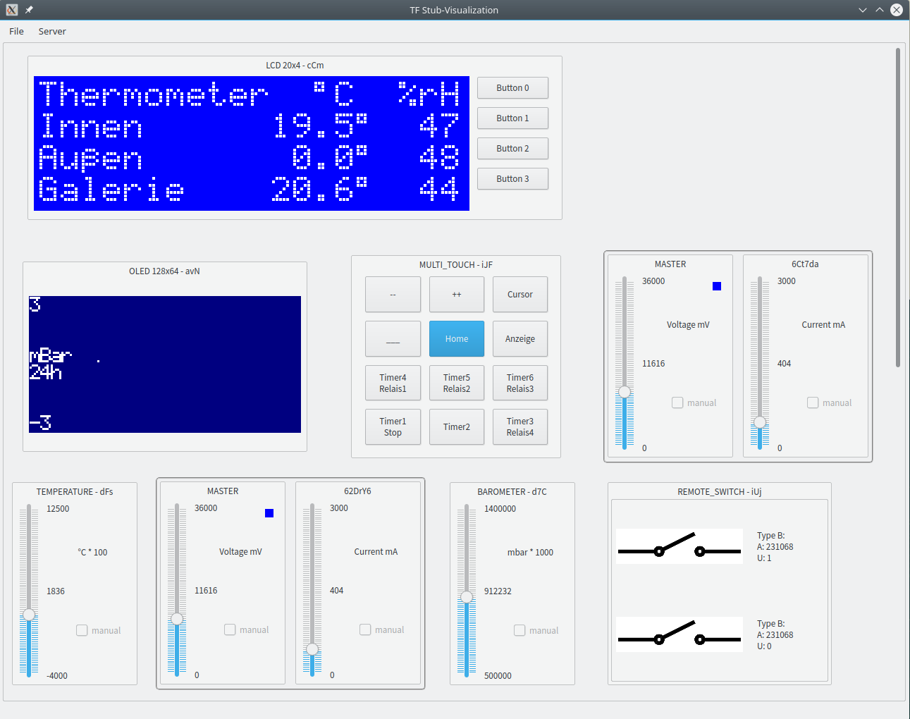

TFStubViz
=========

A Qt based GUI for the software emulator for Tinkerforge Hardware
(see https://github.com/PlayWithIt/TFStubserver)

In order to build this project you'll need the TFStubserver project too.

While TFStubserver is purely command line based, this user interface includes
the command line emulator and offers basic support to display current sensors
and has the possibility to manually override sensor values vis sliders and
shows the content of a 'simulated screen'.

The UI miuight look like this with a sample configuration for sensors and an LCD:

Requirements:
-------------
* Linux
* g++ 4.6.3 or higher (as on Raspberry PI, OpenSuse 13.1)
* clang++ 3.3 (llvm) or higher should work too
* Qt 5.4

Compile:
--------
* be sure that ``TFStubserver`` is installed too in the same folder as ``TFStubViz``
* be sure that ``qmake`` is in your PATH and points to the correct Qt version
  e.g. use ``export PATH=~/Qt/5.4/gcc_64/bin:$PATH``
* run ``make`` (or something like ``make -j4``) in the base directory for a debug-build

Run:
--------
* start ``build/TFStubViz``
* or switch to ``TFStubserver/src/stubserver`` and run ``{your-path}/TFStubViz
-d homestation.properties`` as a full example.
* you can switch the configuration properties also by menu
* the default port is 4225, you can change this with the option ``-p port``
* start ``brickv`` (or your app) and use port 4225 instead of 4223
